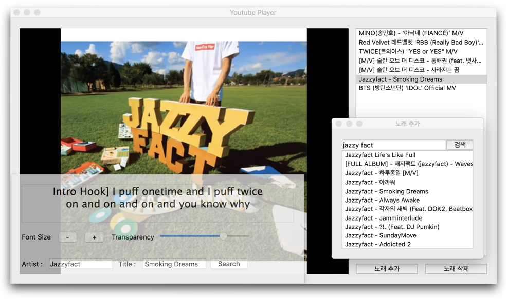

# 2018년 소프트웨어 프로젝트 2 Adventure Design과제

  

### 제작자
| 학번 | 이름 |
| :-: | :-: |
| 20181578 | 김덕원 |
| 20181579 | 김도엽 |
 

<b>현재 빌드 상황</b>

 
<table>
	<tr>
		<td>Branch</td>
		<td>Status</td>
	</tr>
	<tr>
		<td>master</td>
		<td></td>
	</tr>
	<tr>
		<td>dev</td>
		<td></td>
	</tr>
    <tr>
		<td>test</td>
		<td></td>
	</tr>
</table>

 

## 설명
2018년 2학기 소프트웨어 프로젝트 AD과제 저장소입니다. 🤩

유튜브 영상을 QWebEngineView를 이용해 출력하고, 

알송 가사 서버에서 가사를 가져와 유사 플레이어를 제작했습니다.

아래 기술들이 들어가있습니다.
* Python 3.6
* PyQt5
* Html, Css, Js
* POST, GET methods

## 스크린샷

  

 

  

 
